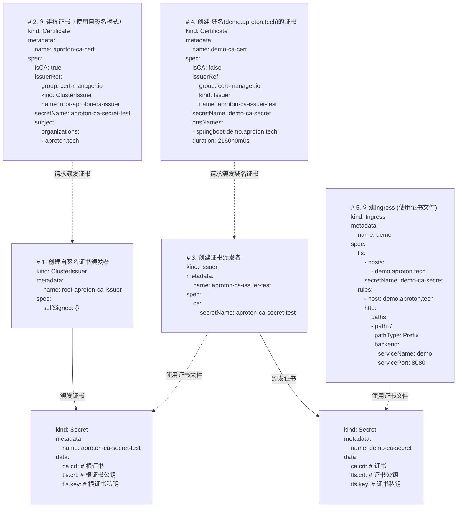

# 证书

目前大部分的浏览器都开始首选使用`HTTPS`服务，如果使用`HTTP`访问服务，浏览器甚至会提示不安全；此外`HTTPS`模式也的确会保护数据，针对`HTTPS`的基础设施能力现在也比较强，所以推荐使用`HTTPS`来搭建服务。

下面就介绍通过`Cert-Manager`+`Traefik`来管理证书，提供`HTTPS`服务。

## Cert-Manager

### CRD简介
K8s 中使用 [cert-manager](https://github.com/cert-manager/cert-manager) 来管理证书的生成。
其中涉及的几个CRD如下：
| CRD | 意义 | 其他 |
| - | - | - |
| Issuer | 证书颁发者 | 相对 `ClusterIssuer`，只能针对某个Namespace生效 |
| ClusterIssuer | 证书颁发者 | 相对 `Issuer`，可以为所有Namespace的`Certificate`颁发证书 |
| Certificate | 证书 | 可以生成CA的证书，也可以服务器（域名）证书，证书的内容会保存到指定的`Secret`中 |
| Secret | 秘密内容 | 在这里用于保存证书的实际内容，包含文件： ca.cert/tls.cert/tls.key |

### 安装
安装`K3s`时会自动安装`Cert-Manager`；当然手动安装也比较简单：
```shell
# 参考文档: https://cert-manager.io/docs/installation/ 
kubectl apply -f https://github.com/cert-manager/cert-manager/releases/download/v1.16.2/cert-manager.yaml
```

## K8s使用Let's Encrypt生成证书
当有自己的域名后，可以通过`Let's Encrypt`来生成正式的证书（非自签证书），为了让`Let's Encrypt`验证域名的所有权，所有一般有2种方法：
- HTTP-01:   
  * 原理: `Let's Encrypt` 访问 `http://<your-domain>/.well-known/acme-challenge/<filename>` 来验证域名所有权； `<filename>`及其内容由`Let's Encrypt`提供。
  * 条件: 需要域名可以公网访问，且必须是`80`,`443`端口
- DNS-01:  
  * 原理: `Let's Encrypt` 通过`DNS`解析 `_acme-challenge.your.domain` 来验证域名所有权；域名内容由`Let's Encrypt`提供。
  * 条件: 需要自动新增/修改`DNS`解析API+权限

`Cert-Manager`封装了相关的过程，所以实际使用时，可以结合上述条件来实现证书自动签发； 结合`Ingress`能力，签发过程会非常简单。

<details>
<summary>YAML示例</summary>

- 1. 创建`ClusterIssuer`
```yaml
apiVersion: cert-manager.io/v1
kind: ClusterIssuer
metadata:
  name: letsencrypt-aproton
spec:
  acme:
    email: kuper@aproton.tech
    privateKeySecretRef:
      name: letsencrypt-aproton-tls-key
    server: https://acme-v02.api.letsencrypt.org/directory
    solvers:
    - http01:
        ingress:
          class: traefik
```

- 2. 创建`Certificate`签发证书
```yaml
apiVersion: cert-manager.io/v1
kind: Certificate
metadata:
  name: www-aproton-tech-cert
spec:
  dnsNames:
  - www.aproton.tech
  issuerRef:
    kind: ClusterIssuer
    name: letsencrypt-aproton
  secretName: www-aproton-tech-certs
```

- 3. `Ingress`使用证书
```yaml
apiVersion: networking.k8s.io/v1
kind: Ingress
metadata:
  name: app-ingress
  namespace: default
spec:
  ingressClassName: traefik
  rules:
  - host: www.aproton.tech
    http:
      paths:
      - backend:
          service:
            name: ngx-service
            port:
              number: 80
        path: /
        pathType: Prefix
  tls:
  - hosts:
    - www.aproton.tech
    secretName: www-aproton-tech-certs
```

</details>


## K8s如何生成自签证书

### 各CRD关系

自签证书比`Let's Encrypt`模式稍微复杂一点，可以参考下文。 这里只展示了CRD核心内容，细节YAML公开内容很多，所以这里就不展示了（如果确实有需要可以`comment`再补充）。

<details>
<summary>CRD关系图</summary>



</details>


### 如何通过自签证书访问
如果根证书使用的是自签的证书，当通过HTTPS模式访问应用（对应的Ingress域名）时会提示证书不可用的情况

为了不提示类似问题，有两种方法：
- 0. 直接忽略证书校验
```bash
curl -k https://demo.aproton.tech:30504/hello
```

- 1. 在 curl 中指定证书
```bash
# curl --cacert ca.pem https://demo.aproton.tech:30504/hello
# curl --cacert ca.cert --resolve "demo.aproton.tech:30504:172.19.42.9"  https://aproton.tech:30504/hello
```

- 2. 在 所在机器（or容器）中 安装自签名的根证书

## 证书的自动同步
通过 `Certificate` 签发出来证书(`Secret`)，只能属于某个Namespace，当其他Namespace想要使用这个证书时，比如想挂载到容器中，会因为跨Namespace而无权限使用。
集合 [kubernetes-reflector](https://github.com/emberstack/kubernetes-reflector) 项目，可以实现 `Certificate` 所生成的证书`Secret`，自动同步到其他Namespace

示例：
```yaml
apiVersion: cert-manager.io/v1
kind: Certificate
metadata:
  name: source
  namespace: cert-manager
spec:
  secretName: aproton-ca-cert
  secretTemplate:
    annotations:
      reflector.v1.k8s.emberstack.com/reflection-allowed: "true"
      reflector.v1.k8s.emberstack.com/reflection-auto-enabled: "true"
      reflector.v1.k8s.emberstack.com/reflection-allowed-namespaces: ""  # Sync to all namespaces
```

> 参考资料:
> - [Syncing Secrets Across Namespaces](https://cert-manager.io/v1.8-docs/faq/sync-secrets/)
> - [Installation](https://cert-manager.io/docs/installation/)
> - [HTTP Validation (http-01)](https://docs.certifytheweb.com/docs/http-validation)