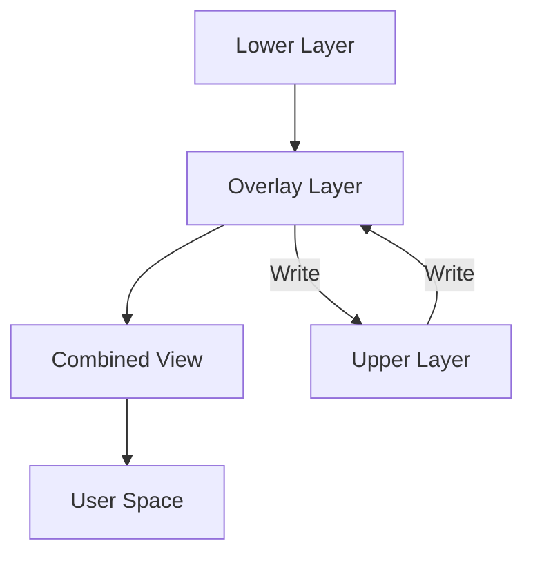

<script type="module">  
  import mermaid from 'https://cdn.jsdelivr.net/npm/mermaid@10/dist/mermaid.esm.min.mjs';  
  mermaid.initialize({ startOnLoad: true });
</script>  

前段时间工作不忙，又多看了一下容器的一些底层原理，之前一直都知道容器是通过`Linux Namespace`,`CGroup`等原理来实现资源隔离和资源控制的，但是具体的实现不是很清楚，所以写了一个简单的`Container`进程来进行一些原理性的学习。

在实现过程中，发现了有一些有趣的细节，所以记录一下过程。当然也参考了很多现有的资料，附录中会标注。

# 确立目标
在所有工作开展前，需要先确定好目标，哪些是重点需要关注的，哪些是可以忽略的
> [需要关注的内容]
- 首先为`Container`项目起一个名字 `SimpleContainer` --> Commnad(`sc`)
- `Container`需要使用`Linux Namespace`来进行资源隔离
- `Container`需要使用`CGroup`来进行资源限制，包括： CPU/MEM
- `Container`需要支持常见的`Docker`命令，比如：
  - 容器管理: `ps`, `run`, `stop`, `rm`
  - 镜像管理: `ls`, `pull`, `save`, `import`

> [可以忽略的内容]
- 容器镜像格式解析部分，可以利用现有其他开源项目处理，暂不关注
- 不需要关注镜像的`build`,`push`等能力
- 不关注`IO`(`Disk`,`Network`)的资源限制
- 不关注`CRI`,只处理`Container`,不关注`Pod`
- 不关注多种多样的挂载模式
- 不关注`cgroup` v1和v2的兼容性, 只使用最新的`cgroup v2`

这样，基本上会得到一个比较简单且能运行演示核心能力的 `Container`

因为涉及到的内容比较多，无法通过一个文章来描述，所以预计会分成这几个文章:
- [Container研究 - 从头实现系列之一（核心原理）](./container-1.md)
- [Container研究 - 从头实现系列之二（镜像管理）](./container-2.md)
- [Container研究 - 从头实现系列之三（容器运行时）](./container-3.md)
- [Container研究 - 从头实现系列之四（容器管理）](./container-4.md)
- [Container研究 - 从头实现系列之五（多进程锁）](./container-5.md)

# 核心原理介绍
在实现`Container`之前，需要复习一下`Linux Namespace`以及`CGroup`相关的原理；把涉及到概念都整理一下。

## Linux Namespace
Linux Namespaces(命名空间)是 Linux 内核的一个特性，用于实现进程隔离。主要是这几种命名空间：
- Mount Namespace: 独立的文件系统视图（即挂载列表）
- PID Namespace: 独立的进程空间及PID
- Network Namespace: 独立的网络空间
- IPC Namespace: 独立的进程间通讯，即：消息队列，共享内存，信号量等
- UTS Namespace: 独立的主机名/域名等
- User Namespace: 独立的用户空间（即不同的用户列表）

通过`Linux Namespaces`技术，每个`Container` 可以使用独立的空间，类似一台独立的机器；但是因为还是使用的相同的操作系统内核，和虚拟机的隔离模式又相互区别。

### 如何创建 `Namespace`
创建新的`Namespace`有如下几种方法：
1. 通过 `clone` 函数  
  在创建新进程时，指定需要创建的`Namespace`
  ```c
    // flags: 可用于标识需要创建的`Namesapce`
    pid_t clone(int flags, void *stack, int *ptid, int *ctid, unsigned long newtls);
  ```

2. 通过 `unshare` 函数/命令  
  通过`unshare`函数或者命令，使当前进程进入新的`Namespace`
  ```c
  // flags: 同`clone`函数  ，可用于标识需要创建的`Namesapce`
  int unshare(int flags);
  ```

### 如何进入已有的 `Namespace`
类似`docker exec`, `docker attach`命令，可以通过 `setns`函数进入指定进程所在的 `Namespace`

```c
// fd: 文件 `/proc/[pid]/ns/[namespace]` 的`fd`, 其中：
//   pid: 指定进程ID
//   namespace: 可选值有 `net`, `pid`, ...等，具体对应不同的`namespace`
int setns(int fd, int nstype);
```

### 如何"退出" `Namespace`
进入到某个`Namespace`之后, 就不存在退出这个概念, 但是有2个方法可以达成类似的效果:
1. 再重新进入进程原来的 `Namespace`
2. 当前进程结束即可退出所在 `Namespace`

## CGroup
CGroup(Control Groups 的缩写)是 Linux 内核的一个特性，用于限制、控制和监视进程组的资源使用情况。它可以对一组进程施加资源限制，确保它们不会超过一定的资源使用量.

CGroup的主要功能:
- 资源控制: 限制进程(组)的`CPU`/`Memory`/`IO`等资源
- 优先级管理: 可以为不同的进程组设置不同的优先级，从而让某些进程可以分配更多的资源
- 资源监控: 监控进程组的资源消耗情况
- 资源隔离: 结合`Linux Namespace`技术，形成进程组的资源隔离

### CGroup V1 和 CGroup V2
cgroup v1和cgroup v2是cgroup机制的两个主要版本, 它们在设计理念和使用方法上存在一些显著差异:
- cgroup v2 中进程只能绑定到`group`树的叶子节点, 且1个进程只能绑定到1个叶子节点上, v1中可以绑定到`group`树中的任意节点, 一个进程也可以绑定到不同的节点上(但是在一个子系统只能绑定1个节点)
- cgroup v2 支持线程模式

总体来说: `cgroup v2`很好的解决了`cgroup v1`中的 不同子系统控制器行为不一致,  资源分配冲突/不确定等等问题

更多细节请参考:
- [cgroup v1与cgroup v2的区别](https://www.alibabacloud.com/help/zh/alinux/support/differences-between-cgroup-v1-and-cgroup-v2)
- [Linux Control Groups V1 和 V2 原理和区别](https://mikechengwei.github.io/2020/06/03/cgroup%E5%8E%9F%E7%90%86/)
- [一篇搞懂容器技术的基石： cgroup](https://moelove.info/2021/11/17/%E4%B8%80%E7%AF%87%E6%90%9E%E6%87%82%E5%AE%B9%E5%99%A8%E6%8A%80%E6%9C%AF%E7%9A%84%E5%9F%BA%E7%9F%B3-cgroup/)

### 资源分配
`cgroup`通过`VFS`将相关能力暴露给用户, 用户只需要按照操作文件系统的方式, 就可以操作`cgroup`. 这里只按照`cgroup v2`来介绍如何管理进程资源.

示例:
```plain
/sys/fs/cgroup/system.slice/cpu.shares                     --> 200
                           /task1/cpu.shares               --> 100
                           /task2/cpu.shares               --> 200
                                 /subtask1/cpu.shares      --> 100
                                 /subtask2/cpu.shares      --> 200
/sys/fs/cgroup/user.slice/                                 --> 100
                         /app1/cpu.shares                  --> 100
                         /app2/cpu.shares                  --> 300                         
```
假如 `task1`, `subtask1/2`, `app1/2` 都是一个死循环，并且机器只有单核，那么他们的CPU占用分别是
| task | cpu usage |
| - | - |
| task1 | 2/3 * 1/3 = 2/9 |
| subtask1 | 2/3 * 2/3 * 1/3 = 4/27 |
| subtask2 | 2/3 * 2/3 * 2/3 = 8/27 |
| app1 | 1/3 * 1/4 = 1/12 |
| app2 | 1/3 * 3/4 = 1/4 |


以下是几个核心概念:
- cgroup controller: `cgroup` 子系统/控制器，分别用来控制不同资源类型的使用, 比如： cpu/memory/cpuset/...
  * cgroup.controllers: 当前节点打开(or支持)的控制器
  * cgroup.subtree_control: 子节点(目录)可以打开(or支持)的控制器，子节点的`cgroup.controllers`不能超出这个范围
- cgroup.procs: `cgroup`关联的进程`pid`列表（叶子节点才有进程列表）


## RootFS
大家都知道，`Container`使用独立的文件系统,在新的文件系统中，需要包含`rootfs`, 新的`Container`启动后，使用`chroot`切换进程根目录(`/`)到新的`rootfs`所在目录，这个目录其实就是容器的镜像解压之后的目录。

这会产生2个新的问题：
- 一个镜像可能启动多个`Container`,那么需要重新解压
- 进程运行后，会产生新的文件,可能修改/删除原镜像的文件

所以如果按照最原始的方法，每次新的`Container`都重新解压镜像，会产生大量的`IO`，并且有重复拷贝，占用的磁盘空间就会很大。

### Overlay文件系统
`Overlay` 文件系统主要是通过合并多个目录来产生一个新的文件挂载点；通过`Overlay`文件系统可以解决`Container`运行时的磁盘空间占用，以及启动的效率问题。



这里不详细介绍`Overlay`文件系统，具体可以寻找相关的资料阅读。


## 权限
使用容器的时候，经常会接触到`特权容器`这样的概念，其实这个主要是因为`docker`之类的runtime为了容器的安全性，默认并没有给到容器内的进程一些比较高的权限（特别是系统`root`的一些权限）, 但是有的时候，为了在容器内完成一些操作(比如: mount)，必须要把相应的权限给到容器内。

Linux的权限类似`cgroup`也是通过文件来操作的, 比如一个进程拥有的权限可以根据文件`/proc/<pid>/status`查看。  
主要是这几个参数:
```plain
# cat /proc/<pid>/status | grep -i cap
CapInh: 0000000000000000
CapPrm: 0000000000000000
CapEff: 0000000000000000
CapBnd: 000001ffffffffff
CapAmb: 0000000000000000
```
其中：
- CapEff: 当前进程拥有的权限，每一个`bit`对应一个权限，具体可以参考这里 [linux/capability.h](https://fossd.anu.edu.au/linux/latest/source/include/uapi/linux/capability.h)
- CapInh: 子进程可以继承的权限， 子进程的 `CapEff` 不会超出 `CapInh`

linux 中可以通过 `syscall`的 [`capget/capset`](https://man7.org/linux/man-pages/man2/capset.2.html) 能力来对权限编程。 

通过上述描述， 很容易联想到 `Docker`等容器运行时中，主要就是通过对容器子进程的`CapEff`进行编程从而实现权限控制。

# 代码结构
我们首先介绍一下代码的整体结构，方便查看和理解代码。

```plain
.
├── container             # 容器运行时
├── image                 # 镜像管理
├── utils                 # 日志等工具类
└── main.go               # 入口文件

```

借助于`cobra.Command`，定义以下的命令（使用方法基本上保持和`docker`类似）

| Command | SubCommand | 描述 |
| - | - | - |
| image | list | 本地镜像列表 |
| | pull | 拉取远程镜像 |
| | tag | 重命名镜像 |
| | save | 导出镜像到`tar`文件 |
| | load | 从`tar`文件加载镜像 |
| | rm | 删除镜像 |
| container | list | 容器列表 |
| | run | 运行容器 |
| | stop | 停止容器 |
| | rm | 删除容器 |
| ps | | 等同于`container ls`, 和`docker`对齐 |
| run | | 等同于`container run`, 和`docker`对齐 |