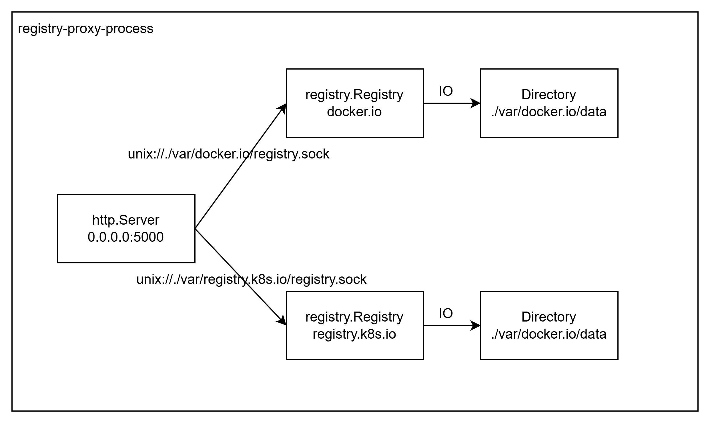

国内镜像拉取环境的恶劣程度的加剧，好不容易拉取下来的镜像，因为环境的重建等原因，又要重头拉取，非常耗费时间，而且还很不稳定。  
如果有一套自己的镜像拉取代理，那么之前拉取的镜像都保存在代理中，后续重新拉取就简单多了，再也不用煎熬了。

一般搭建镜像代理可以使用 [`registry`](https://hub.docker.com/_/registry) 搭建即可，不论是直接使用`docker`还是`kubernetes`都非常方便；但是最大的一个问题是，`registry`官方并不会支持多`namespace`；  
比如`docker.io`, `registry.k8s.io`两个不同的镜像仓库，需要部署2套不一样的`registry-proxy`服务；然后再借助`nginx`等服务进行反向代理，来映射到不同的`registry-proxy`服务; 非常不方便。

查找了一些资料， `registry`实际上对应的是开源项目 [distribution/distribution](https://github.com/distribution/distribution) 编译出的镜像； 在Issue中发现有一些前驱实际上已经发现这个问题，并且也在尝试进行一些修改，比如：
- [[WIP] Support to cache multiple remote registries](https://github.com/distribution/distribution/pull/4506)
- [Add support for namespaces in proxy registry](https://github.com/distribution/distribution/pull/3864)

但是因为一些标准原因，导致这些`PR`迟迟无法合并；如果自己维护一个`fork`,后续官方的代码更新合并也是一个问题。

所以这里换了一个角度来解决这个问题，既然短时间无法让提交的`PR`合并，那么我们直接使用`registry`代码作为`lib`构建一个支持多`namespace`的镜像代理。 

代码请跳转这里 [registry-proxy](https://github.com/aprotontech/registry-proxy)


# 原理分析
通过对[registry](https://github.com/distribution/distribution/blob/main/registry/root.go)代码的分析，实际上`registry-proxy`会产生一个 `registry.Registry` 对象，那么：
- 每个`namespace`创建一个`registry.Registry`
- 每个监听在一个本地`unix socket`上
- 前置`HTTP Server`根据URL中的请求参数`ns`，分发到不同的`unix socket`上




# 安装
## Docker 本地部署
- 快速部署: 自动支持所有的`namespace`
```
docker run -d --restart always --name registry-proxy -p 5000:5000 \
  -v $PWD/var:/root/var \
  docker.io/aproton/registry-proxy:latest
```

- 指定`Namespace`配置: 对每个`namespace`进行精细的配置
```
docker run -d --restart always --name registry-proxy -p 5000:5000 \
  -v $PWD/var:/root/var \
  -v $PWD/config:/root/config \
  docker.io/aproton/registry-proxy:latest
```

其中 `$PWD/config` 是一个配置文件目录，包含以下文件:
| 文件名 | 意义 | 格式 |
| - | - | - |
| main.yaml | 主配置文件 | |
| docker.io.yaml | `docker.io` 的代理配置 | |


# 代码介绍

