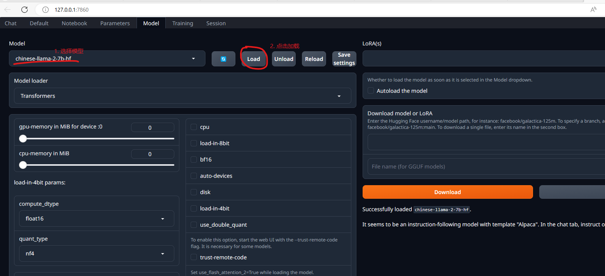

当下带有UI界面的开源大模型项目也有一些，随便挑了一个来体验一下。 选择的项目是 text-generation-webui
项目地址： https://github.com/oobabooga/text-generation-webui

# 下载代码

先checkout text-generation-webui的代码
```go
# 用ssh clone比较好，不容易被墙（但是需要自己配置好ssh秘钥）
# 注意目录不要有中文和空格
git clone git@github.com:oobabooga/text-generation-webui.git
```


# 启动安装

在 text-generation-webui 目录中，执行 `start_windows.bat` 脚本

一开始会需要选择 `GPU` 的型号，以及Cuda的版本，结合自己的实际情况选择就可以了，如果选错了，就重头来就好了

但是这里最大的问题就是，因为网络原因，非常容易失败， 如果失败了，就反复重复执行 `start_windows.bat` 和 `update_windows.bat` 这两个脚本。直到 `start_windows.bat`  脚本执行成功为止

`start_windows.bat` 执行成功，会显示如下：


# 下载大模型

简单体验建议先去 [Chinese-LLaMA-Alpaca](https://github.com/ymcui/Chinese-LLaMA-Alpaca) 下载中文大模型，选择最基本的 `Chinese-LLaMA-Plus-7B` 模型下载即可


建议选择百度网盘下载。 为了大模型，为百度充点值还是划得来的。

下载完的模型解压后，放到 `text-generation-webui\models` 目录下


# 体验大模型

接下来就按照 第一步安装命令行中的 地址打开，就可以体验大模型了。

1. 先选择Model页，选择需要的大模型，点击Load加载模型




2. 进入Chat页，自由对话
注意：GPU模式下，需要问题前面增加 `[用中文回答]` 大模型才会用中文回答，否则会默认回答英文


